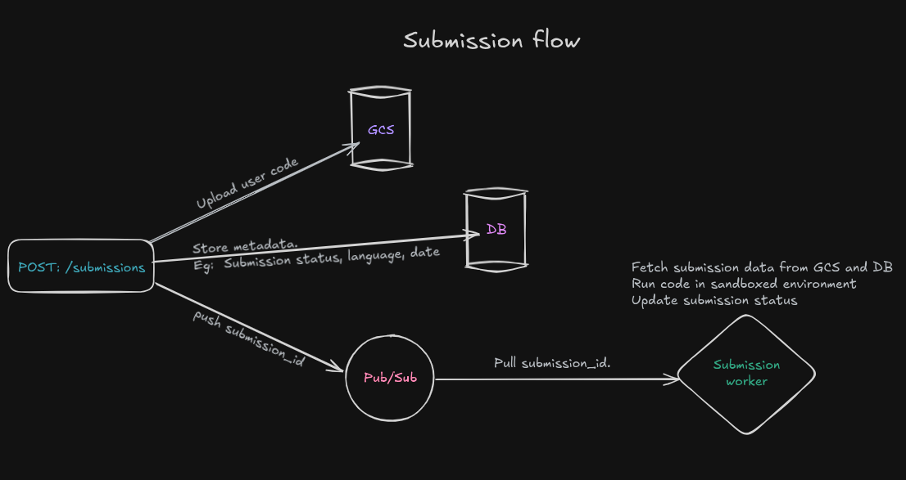

# CodeQuest

This is CodeQuest a small scale replication of platforms like LeetCode, Codeforces etc. I built this project to explore the system design of such platforms and how to make sandboxed execution environments for code.

## Table of Contents

- [Techstack](#techstack)
- [System Design](#system-design)
- [Design Decisions](#design-decisions)
- [TODOs](#todos)

## Techstack

- **Frontend**

  - Next.js (App Router)
  - Shadcn UI
  - Tailwind CSS

- **Backend**

  - FastAPI
  - MongoDB
  - Pub/Sub

- **DevOps**

  - Docker
  - Vercel: For next.js deployment
  - Google cloud run: For backend REST API deployment
  - Google cloud pub/sub: For submission processing
  - Google compute engine: For running the worker
  - Google cloud storage: For storing user uploaded files

## System Design

The submission flow is the core of the system design of the platform. It involves google cloud storage for code files, google cloud pub/sub for asynchronously communicating with the submission worker and off loading the task of message delivery and persistence to google cloud pub/sub.

## Design Decisions

1. Event-Driven Architecture: The use of Google Cloud Pub/Sub allows for decoupling of components and asynchronous processing of submissions, which is crucial for handling high loads and ensuring responsiveness.

2. Sandboxed Execution: The worker spins up a Docker container for each submission with it's respective language runtime and then executes the code in it and compares the output with expected output. The docker containers protect the following system resources:

   - CPU: Limits the CPU usage to prevent abuse.
   - RAM: Limits the memory usage to prevent crashing the host.
   - Storage: Each submission runs in a read only mount to prevent abuse of storage.
   - Network: The container has no external network access.

3. Next.js for Frontend: The choice of Next.js with App Router allows for a modern, server-rendered React application with advanced optimizations like caching.

4. Cloud Run for Backend: FastAPI is deployed on Google Cloud Run, which provides a serverless environment that scales automatically.

5. Compute Engine for submission-worker: The choice of using a virtual machine allowed finer control to store language runtime images and spinup containers for execution of submissions. However this isn't autoscalabale.

## TODOs

- Add some realtime capabilities which allows users to see their submission status update realtime without reload.
- Add support for more language runtimes.
- Add profile page UI for users and admin.
- Add discuss forum.
- Make the submission-worker autoscalable
